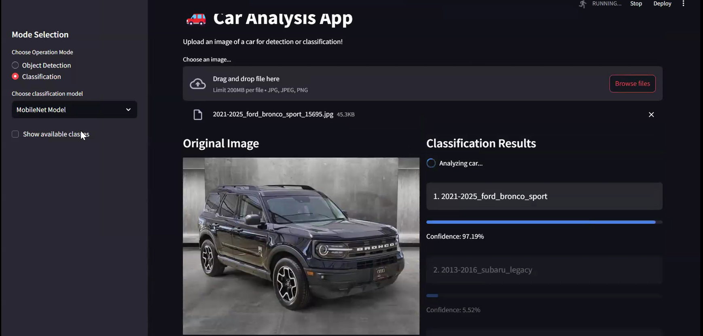
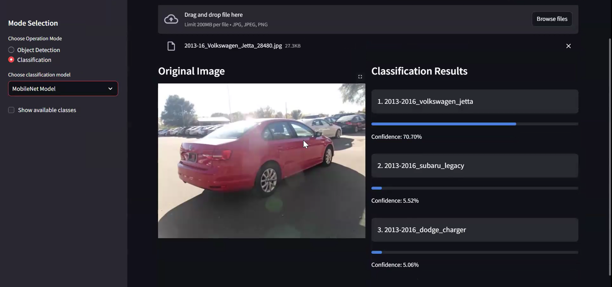

# Car Detection and Classification Project

This repository contains the code, data preparation steps, and final models for our **Deep Vision System for Vehicle Make/Model Recognition and Multi-Object Detection** project, developed as part of the Advanced Computer Vision course. This project showcases object detection and vehicle classification using deep learning techniques, such as YOLO, ResNet50, and MobileNet.

## Table of Contents
1. [Project Overview](#project-overview)
2. [Key Features](#key-features)
3. [Dataset](#dataset)
4. [Approach](#approach)
5. [Results](#results)
6. [How to Use](#how-to-use)
7. [Future Work](#future-work)
8. [Contributors](#contributors)

---

## Project Overview
Modern applications in law enforcement, insurance, and smart cities demand accurate and efficient vehicle identification systems. Our solution addresses these needs by:
- Detecting cars in images and filtering out irrelevant objects.
- Classifying cars by make, model, and year from a curated dataset of over 29,000 images.
- **Enabling impactful use cases** such as:
  - **Law enforcement**: Identifying stolen vehicles and managing toll violations.
  - **Insurance**: Automating claim assessments and fraud detection.
  - **Smart cities**: Supporting traffic monitoring, parking management, and urban planning.

By expanding upon the Stanford Cars Dataset with modern and diverse data, this project bridges a critical gap in vehicle datasets by including cars manufactured after 2013. This extension:
- Enhances the relevance of vehicle recognition systems for current industry needs.
- Provides a more comprehensive dataset for training models on modern vehicles.
- Unlocks new possibilities for real-time applications and analytics in diverse sectors.

This project was built to handle real-world challenges such as noisy data, imbalanced datasets, and diverse vehicle appearances.

---

## Key Features
- **Object Detection:** Fine-tuned YOLOv8 model for car detection.
- **Vehicle Classification:** MobileNet and ResNet50 models for identifying 391 vehicle classes.
- **Data Augmentation and Cleaning:** Extensive preprocessing of noisy real-world data from Craigslist.
- **Streamlit Web App:** A user-friendly interface to test object detection and classification.

---

## Dataset
We combined:
- **Stanford Cars Dataset**: A classic dataset with 16,185 images.
- **Scraped Craigslist Images**: ~30,000 images of modern vehicles from 2013 onwards.

The final dataset contains:
- 29,126 labeled images
- 391 unique vehicle classes

---

## Approach
1. **Data Preparation**: 
   - Standardized labels using fuzzy matching.
   - Filtered out classes with fewer than 40 samples.
2. **Object Detection**:
   - Fine-tuned YOLOv8 on the Stanford Cars dataset.
3. **Vehicle Classification**:
   - Trained MobileNet and ResNet50 models with transfer learning.
4. **Deployment**:
   - Developed a Streamlit app for real-time vehicle analysis.

---

## Results
- **Object Detection**: Fine-tuned YOLO achieved superior performance on noisy, real-world images.
- **Classification**:
  - MobileNet achieved 62.84% accuracy.
  - ResNet50 achieved 45.7% accuracy.
- **App Demo**: A web-based app showcasing object detection and classification.

**Sample output 1:**

**Sample output 2:**

---

## Future Work
1. **Dataset Expansion**: Double dataset size and diversify data sources.
2. **Model Improvements**: Explore Vision Transformers for classification.
3. **Federated Learning**: Incorporate user-uploaded images while maintaining privacy.

---

## Contributors
- William DeForest
- Arnav Pillai
- Daichi Ishikawa
- Kshitiz Sahay
