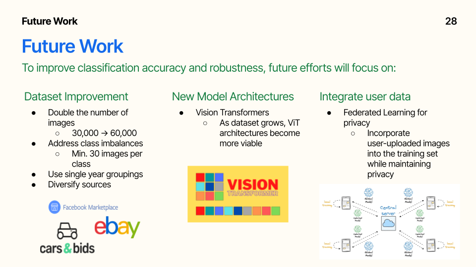

# Deep Vision System for Vehicle Make/Model Recognition and Multi-Object Detection
## Advanced Computer Vision & Deep Learning final Project

This repository contains the code, data preparation steps, and final models for our **Deep Vision System for Vehicle Make/Model Recognition and Multi-Object Detection** project, developed as part of the Advanced Computer Vision course. This project showcases object detection and vehicle classification using deep learning techniques, such as YOLO, ResNet50, and MobileNet.

## Table of Contents
1. [Business Problem](#business-problem)
2. [Proposed Solution](#proposed-solution)
3. [Data Collection](#data-collection)
4. [Methodology](#methodology)
5. [Results](#results)
6. [Deployment and Maintenance](#deployment-and-maintenance)
7. [Future Work](#future-work)
8. [Contributors](#contributors)

---

## Business Problem
Modern applications in law enforcement, insurance, and smart cities demand accurate and efficient vehicle identification systems. Our solution addresses these needs by:
- Automating vehicle identification to reduce manual efforts.
- Supporting **law enforcement** with tools for identifying stolen vehicles and managing toll violations.
- Assisting the **insurance** sector in automating claim assessments and fraud detection.
- Enhancing **smart cities** with traffic monitoring, parking management, and urban planning.

Vehicle theft and insurance fraud are on the rise, particularly in regions like Washington D.C. and Colorado, where auto theft rates have increased significantly. This project aims to address these issues with modern computer vision techniques.

  
  

---

## Proposed Solution
Our solution, the **Deep Vision System for Vehicle Recognition**, leverages advanced deep learning models to:
- Detect vehicles in images with fine-tuned YOLOv8.
- Classify vehicles by make, model, and year using ResNet50 and MobileNet.
- Provide a web app for real-time vehicle analysis.

This system bridges the gap between outdated datasets and modern applications by incorporating data from newer vehicles.

  
  

---

## Data Collection
To develop this system, we combined:
- **Stanford Cars Dataset**: A classic dataset with 16,185 images across 196 car classes, categorized by make, model, and year. However, the dataset hasn’t been updated since 2012.
- **Scraped Craigslist Images**: ~30,000 images of vehicles from 2013 and newer, collected from 20 cities across the U.S., providing modern and diverse data.

After cleaning and merging, the final dataset contains:
- 29,126 labeled images.
- 391 unique vehicle classes.

This dataset addresses limitations of previous datasets by representing a broader range of modern vehicles.

  
  

---

## Methodology
### Data Preparation
1. **Label Standardization**: Used fuzzy matching to consolidate messy listings.
2. **Filtering**: Retained classes with at least 40 images.

  
  

### Object Detection
- Fine-tuned YOLOv8 Nano on the Stanford Cars dataset.
- Converted bounding box annotations to YOLO format.
- Trained for 25 epochs using a custom configuration.

  
  

### Vehicle Classification
- Trained ResNet50 and MobileNet using transfer learning.
- Fine-tuned MobileNet by unfreezing the last 16 layers for enhanced feature extraction.
- Optimized models with data augmentation and regularization techniques.

  
  

---

## Results
### Object Detection
- Fine-tuned YOLOv8 significantly outperformed pre-trained YOLO on noisy, real-world images.

### Vehicle Classification
- MobileNet achieved a test accuracy of **62.84%**.
- ResNet50 achieved a test accuracy of **45.7%**.

  
  

### Key Insights
- MobileNet excelled in real-time applications with modern vehicles, particularly on scraped Craigslist data.
- YOLO models demonstrated robust object detection across diverse image qualities.

---

## Deployment and Maintenance
We developed a user-friendly **Streamlit web app** to demonstrate:
1. Object detection results with bounding boxes.
2. Vehicle classification outputs with confidence scores.

**Maintenance Strategy:**
- Retrain models every six months using flagged misclassifications.
- Update datasets annually by scraping new images.

  

---

## Future Work
1. **Dataset Expansion**:
   - Double the dataset size.
   - Address class imbalances and include vehicles from platforms like Facebook Marketplace and eBay.
2. **New Architectures**:
   - Experiment with Vision Transformers for improved accuracy.
3. **Federated Learning**:
   - Incorporate user-uploaded images while ensuring privacy.

  

---

## Contributors
- William DeForest
- Arnav Pillai
- Daichi Ishikawa
- Kshitiz Sahay
